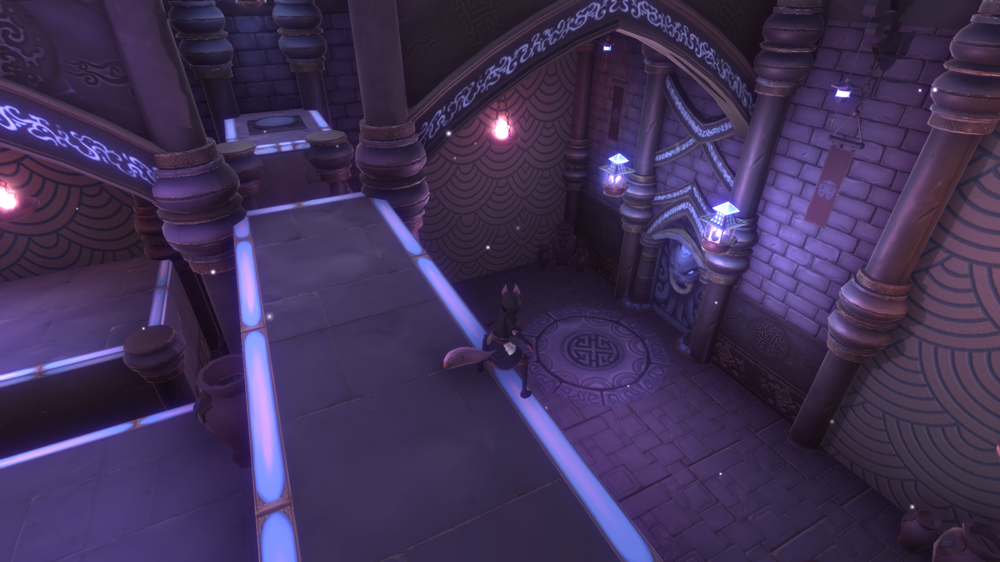
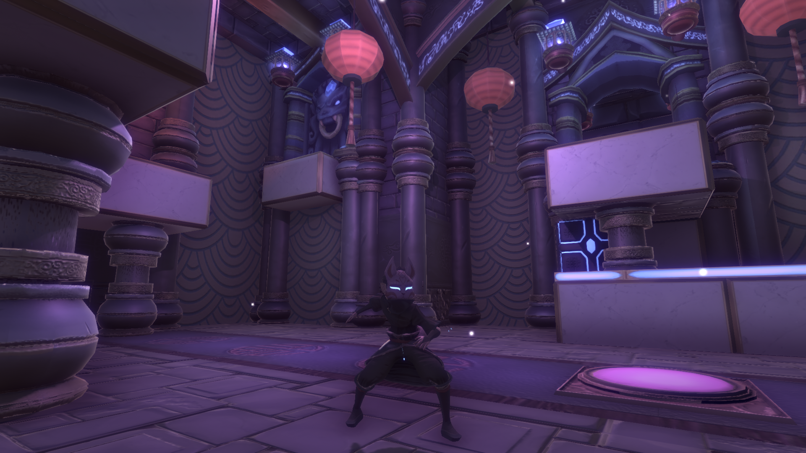
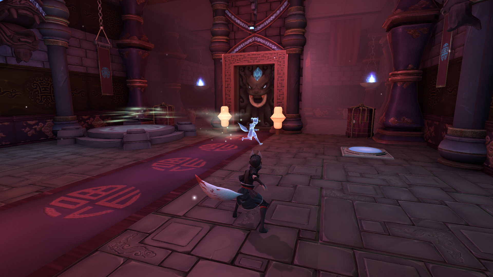
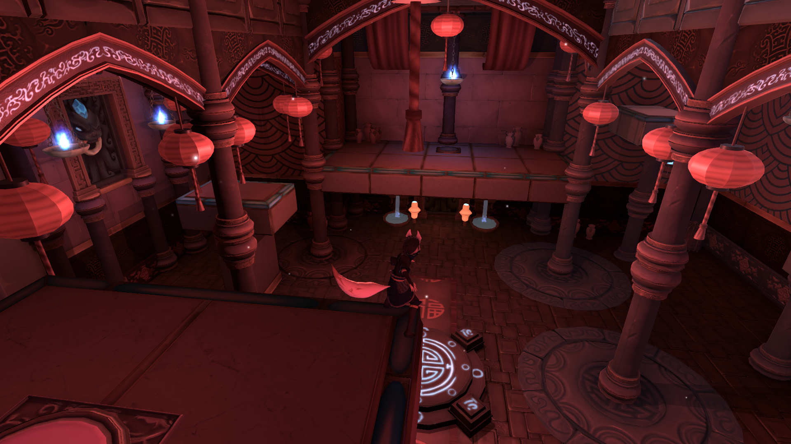
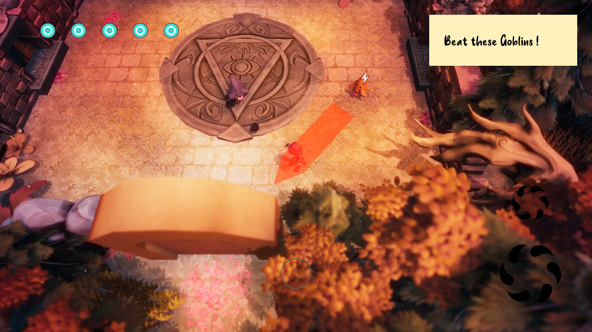
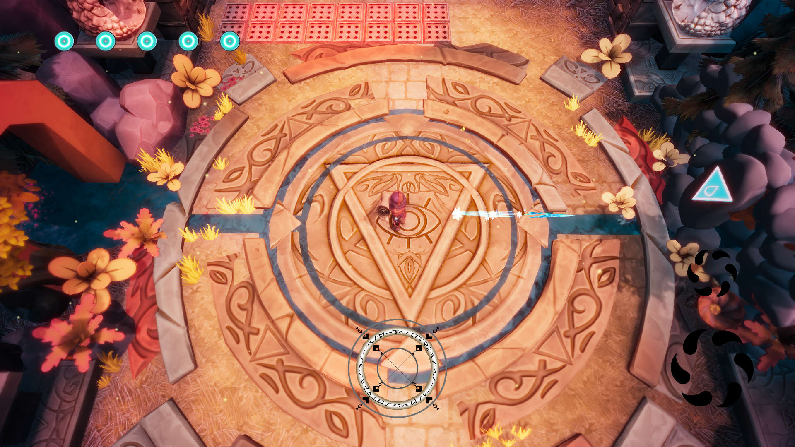
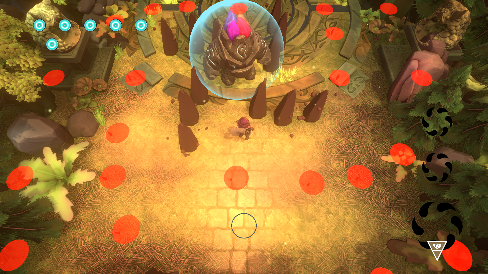

# Projets étudiant

## Inari
- Type : Puzzle/Plateformer 3D
- Team : 4 Graphists - 5 Programmers
- Role : Polyvalent, Puzzle mechanics, Input controller, User Interface
- Time : 8 Weeks

#### Screen

#### Trailer
*Click on the image*  

## WhichCraft
- Type : 3D Action
- Team : 4 Graphists - 5 Programmers
- Role : Modular spell system, In-game encyclopedia, Editor tooling
- Time : 8 Weeks which 6 remotely

#### Screen

#### Trailer
*Click on the image*  

# Personal Project

## JourneyToTheFarm
#### [GitHub Repository](https://github.com/QuentinLadoire/JourneyToTheFarm)
#### Trailer

## Minecraft Procedural Map
#### [GitHub Repository](https://github.com/QuentinLadoire/MinecraftProceduralMap)
#### Trailer
*Click on the image*  

## CutTheRope
#### [GitHub Repository](https://github.com/QuentinLadoire/CutTheRope)
#### Screen

