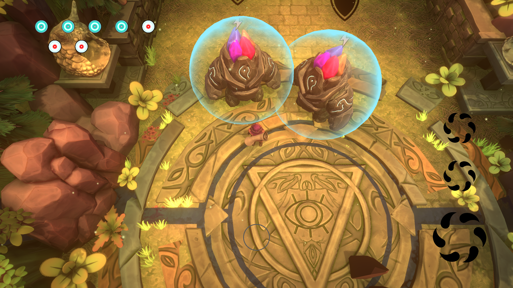

# Student Project

## Inari
Inari is a third person platformer puzzle game.  
The player must to solve all of 3 tower stage and reach the top of the tower and desactivate him core.  
The player will have to help him to resolve the puzzle a recording and replay system of his action.  

This project was realize with a team of 10 people
  - 4 Graphists
  - 6 Programmers

On this project i worked : 
  - In first time on some puzzle feature
  - In second time on the UI
  - In last time on some feedback and fixing bug

#### Screen

#### Trailer
*Click on the image*  

## WhichCraft
WhichCraft is a top down action game.  
The player can combine two alchemical elements for create a spell and defeat the ennemies.  
And the player has a grimoire which lists his dicovered spell, status and enemies.

This project was realize with a team of 10 people
  - 4 Graphists
  - 6 Programmers

On this project i worked :
  - In first time on the spell structure and effect
  - In second time on the Grimoire
  - In last time on some feedback and fixing bug

#### Screen

#### Trailer
*Click on the image*  

# Personal Project

## Minecraft Procedural Map
A oriented procedural map generation like minecraft.  
Implemented Perlin Noise 2D and 3D.  

#### Trailer
*Click on the image*  

#### [GitHub Repository](https://github.com/QuentinLadoire/MinecraftProceduralMap)

## CutTheRope
A CutTheRope like realize with Unity.

#### Screen

#### [GitHub Repository](https://github.com/QuentinLadoire/CutTheRope)
